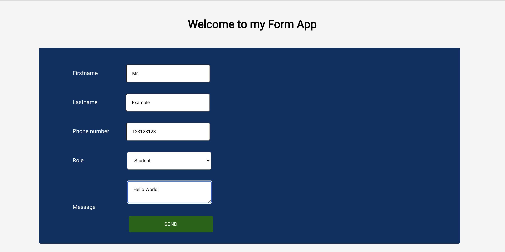
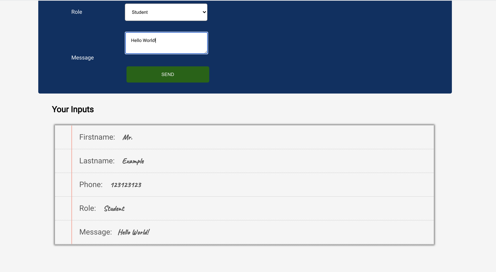
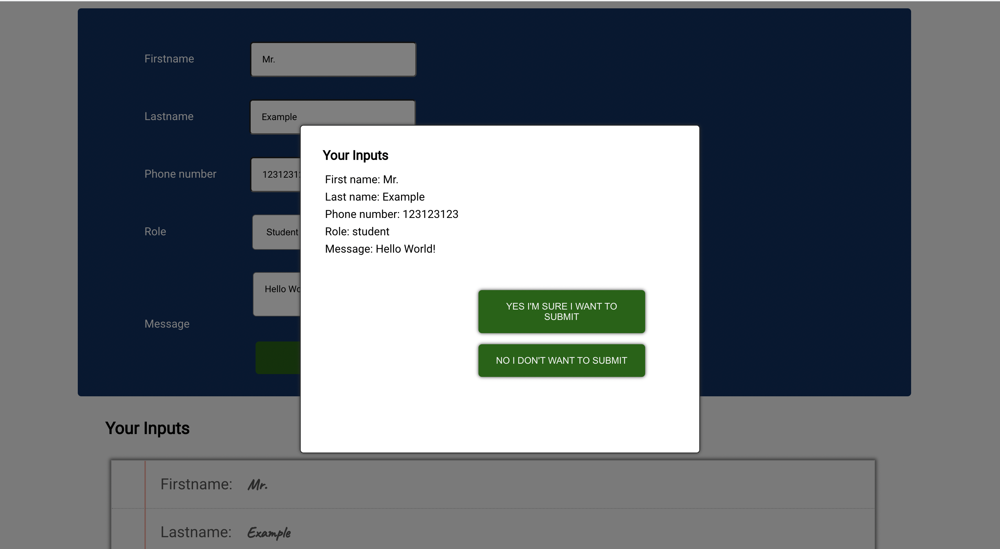

# Form App

## Description:

An application developed with React.js for the Full Stack Web Development program in Business College Helsinki.

In the application the user fills out the pre designed form fields. The data entered is then displayed in another component rendered separately.

Once the user "sends" the filled form a pop up window will appear for the user to verify the data that has been filled and asks is the user sure they want to commit and send the data onwards.

## Used concepts:

Passing props from parent elements to children.

Defining methods in the class components and allowing the app to render the states as they change.

Passing methods from one component to another.

Manipulating the rendering using CSS.

## Application screenshots

